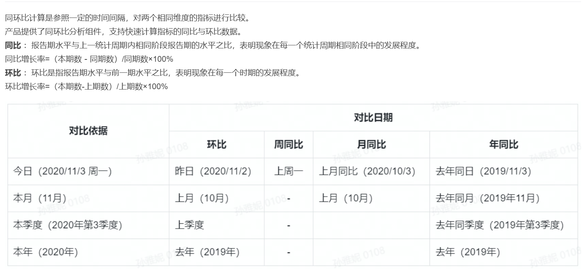

# 图表项目 源码文档
## 项目结构说明
| 模块名称 | 描述                                   |
|------|--------------------------------------|
| jvs-chart-mgr  | 启动类,controller                       |
| jvs-chart-common  | 公共包-包含server,图表的处理,此模块主要目的是为了 其他模块公用 |
| jvs-chart-api  | 集群内部调用 主要是通过Feign 请求 目前只有低代码项目使用     |

## 代码解释
### 图表核心逻辑解释
1. 前端获取图表渲染数据统一入口 [ChartComponentController.java](jvs-chart-mgr%2Fsrc%2Fmain%2Fjava%2Fcn%2Fbctools%2Fchart%2Fcontroller%2FChartComponentController.java) 中的componentPreview方法
2. 所有图表(可能存在个别特殊)的设计都存在 维度与指标  维度分组 指标汇总 通过 [ChartElementInterface.java](jvs-chart-common%2Fsrc%2Fmain%2Fjava%2Fcn%2Fbctools%2Fchart%2Fchart%2FChartElementInterface.java) 此类中的buildSql  方法统一构建查询sql
3. 图表切换为表格数据统一在 [ChartElementInterface.java](jvs-chart-common%2Fsrc%2Fmain%2Fjava%2Fcn%2Fbctools%2Fchart%2Fchart%2FChartElementInterface.java) 中的getTable 中获取
4. 不同的图表处理类都会统一实现[ChartElementInterface.java](jvs-chart-common%2Fsrc%2Fmain%2Fjava%2Fcn%2Fbctools%2Fchart%2Fchart%2FChartElementInterface.java) 这里之所以把不同的图表使用不同的处理类 是为了 防止后面如果前端存在结构变更方便针对不同的图表进行处理
5. 不同的图表处理类 可以查看cn.bctools.chart.enums.ChartElementTypeEnums[ChartElementTypeEnums.java](jvs-chart-common%2Fsrc%2Fmain%2Fjava%2Fcn%2Fbctools%2Fchart%2Fenums%2FChartElementTypeEnums.java) 此枚举中的 cls 就是对应图表的处理类
6. 钻取就是修改 维度的值 可以理解为 修改了 分组字段 所以钻取就只是修改 维度的统计字段
7. 联动 联动就是查询条件

### 数据结构说明
1. 前端传入的 设计数据结构为(这里只说明对于后端有用的-如果需要整个json可以直接 通过f12查看请求的数据json):

### 同环比功能说明

#### 说明其实同环比计算方式一样，唯一区别是时间相差的值不一样 

### git 提交信息
1. feat: 新增功能（feature） 
2. fix: 修复bug 
3. docs: 文档（documentation）更新 
4. style: 代码格式（不影响代码运行的变动） 
5. refactor: 代码重构（既不是修复bug也不是添加新功能的代码更改） 
6. perf: 性能优化（performance） 
7. test: 添加测试或更新测试 
8. build: 构建系统或外部依赖项的更改（如webpack, npm）
9. ci: 持续集成（Continuous Integration）相关的变动
10. chore: 其他不修改src或测试文件的更改，如构建过程或辅助工具的变动
11. revert: 回滚某次提交
12. impr: improvement，小的代码设计改进
13. apm: 仅监控打点、异常日志处理相关
14. jvm: 仅JVM参数变更
15. pom: 仅依赖和版本变化 
16. conf: 仅配置变化，如Spring配置、properties文件 
17. typo: 修复小的拼写错误 
18. wip: work in progress，开发中，少用，用于开发中的不完整提交
