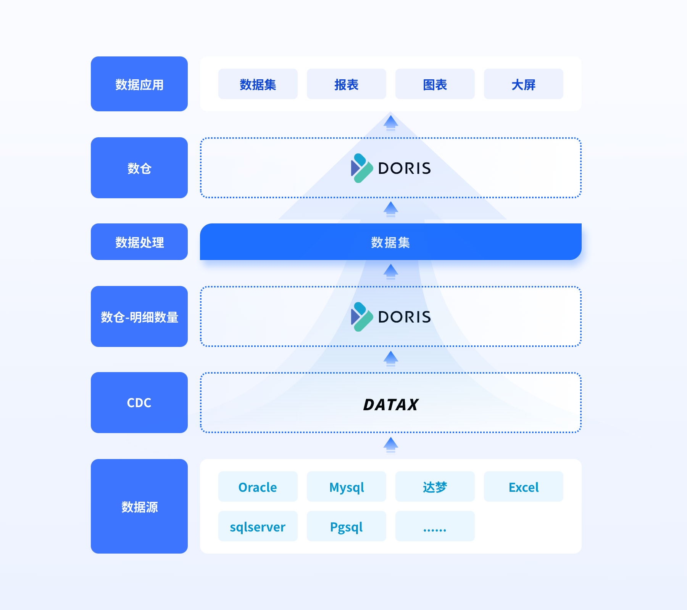

# 数据集介绍

## 模块介绍

| 模块名称                                                           | 描述                                |
|----------------------------------------------------------------|-----------------------------------|
| [jvs-data-factory-mgr](jvs-data-factory-mgr)                   | 启动类,controller                    |
| [jvs-data-factory-common](jvs-data-factory-common)             | 公共包-包含server,数据集核心处理              |
| [jvs-data-factory-api](jvs-data-factory-api)                   | 数据提供给其他服务调用的Feign请求               |
| [jvs-data-factory-data-dispose](jvs-data-factory-data-dispose) | 数据集doris功能的抽取 包括 jdbc的声明 查询条件与聚合等 |

## 架构图


### 代码说明,通过上面架构图 由下往上说明

#### 数据源

1. 数据源 数据源目前负责验证数据库的连接是否正常 数据表结构的获取 与入库
   数据源处理类位置为:[source](jvs-data-factory-common%2Fsrc%2Fmain%2Fjava%2Fcn%2Fbctools%2Fdata%2Ffactory%2Fsource)
2. 不同的数据源都需要继承 [DataSourceExecuteInterface.java](jvs-data-factory-common%2Fsrc%2Fmain%2Fjava%2Fcn%2Fbctools%2Fdata%2Ffactory%2Fsource%2Fdata%2Fservice%2FDataSourceExecuteInterface.java)
不同的数据源
bean名称需要对应[DataSourceTypeEnum.java](jvs-data-factory-common%2Fsrc%2Fmain%2Fjava%2Fcn%2Fbctools%2Fdata%2Ffactory%2Fsource%2Fenums%2FDataSourceTypeEnum.java)
枚举类 调用都是通过 此名称获取的bean

3. 数据源结构输出统一为 [DataSourceStructure.java](jvs-data-factory-common%2Fsrc%2Fmain%2Fjava%2Fcn%2Fbctools%2Fdata%2Ffactory%2Fsource%2Fentity%2FDataSourceStructure.java)
其中结构详细数据中的 dorisType 是通过 数据表 jvs_source_to_doris 进行关联的
处理类为:[DataSourceServiceImpl.java](jvs-data-factory-common%2Fsrc%2Fmain%2Fjava%2Fcn%2Fbctools%2Fdata%2Ffactory%2Fsource%2Fservice%2Fimpl%2FDataSourceServiceImpl.java)
中的 syncTableStructure方法

#### cdc(数据同步) datax

1. 不同的数据源 通过datax同步时配置文件存在差异
   目前不同的数据源都需要实现[DataSourceExecuteInterface.java](jvs-data-factory-common%2Fsrc%2Fmain%2Fjava%2Fcn%2Fbctools%2Fdata%2Ffactory%2Fsource%2Fdata%2Fservice%2FDataSourceExecuteInterface.java)
   类中的 createDataXFileJsonFunction 方法 此方法用于定义不同数据源的 datax 配置json
2. 同步是在数据集中的 输入节点进行同步的
   核心类为:[InputNode.java](jvs-data-factory-common%2Fsrc%2Fmain%2Fjava%2Fcn%2Fbctools%2Fdata%2Ffactory%2Fhtml%2Fnode%2FInputNode.java)
   与 [DataXService.java](jvs-data-factory-common%2Fsrc%2Fmain%2Fjava%2Fcn%2Fbctools%2Fdata%2Ffactory%2Fservice%2FDataXService.java)

#### 数仓doris

1. doris 是整个 bi的核心 包含所有的数据处理与数据展示
2. doris 运营需要开发 人员去熟读 doris官方文档 地址为:https://doris.apache.org/zh-CN/docs/get-starting/quick-start/
3. doris 论坛地址为:https://ask.selectdb.com/questions 如果在使用过程中 存在问题在文档中没有找到的 可以去论坛找找
   如果还是没有可以直接 联系论坛的 doris 社区人员(注意一定要自己认真查找后没有定位到问题再上去问)
4. doris 安装使用的是 第三方开源的管理工具
   文档地址:https://docs.selectdb.com/docs/enterprise/selectdb-enterprise-overview

#### 数据处理(数据集)

1. 数据处理过程中 每个节点都会生成一张临时表 每个节点都是生成sql的方式 进行数据处理的(输入节点是datax 如果数据来源为excel
   是直接同步的 因为excel导入时本来就已经存入到doris中了)
2. 节点的关系与节点的处理调用都是由[FHtmlGraph.java](jvs-data-factory-common%2Fsrc%2Fmain%2Fjava%2Fcn%2Fbctools%2Fdata%2Ffactory%2Fhtml%2FFHtmlGraph.java)类进行处理

3. 所有节点都是
   继承 [Frun.java](jvs-data-factory-common%2Fsrc%2Fmain%2Fjava%2Fcn%2Fbctools%2Fdata%2Ffactory%2Fhtml%2Frun%2FFrun.java)
   类并实现 所有方法 部分方法不用实现 如果方法使用了 default 关键字 就表示此方法可以不用实现 但是需要根据自己新增节点的业务需求来
   不一定所有节点都是不用实现的
4. 所有节点都在 [node](jvs-data-factory-common%2Fsrc%2Fmain%2Fjava%2Fcn%2Fbctools%2Fdata%2Ffactory%2Fhtml%2Fnode) 包下面
5. 数据处理完成后 都是输出到doris中 并记录输出的表名称 并告知数据源 本次的输出字段结构等信息 用于其他应用使用

#### 数据应用

1. 数据应用 需要引入 [jvs-data-factory-data-dispose](jvs-data-factory-data-dispose)
   此模块中[DorisJdbcTemplate.java](jvs-data-factory-data-dispose%2Fsrc%2Fmain%2Fjava%2Fcn%2Fbctools%2Fdata%2Ffactory%2Fconfig%2FDorisJdbcTemplate.java)
   可以直接访问doris
2. 使用方 是通过 数据集id 获取此数据集输出的doris中表名称 然后通过不同的指标与维度 进行分组统计 或者直接明细输出
   数据获取都是由应用方自行获取

### 其他说明

#### 新增doris官方函数说明

1. 直接在 sys_function 新增一条函数即可 注意目前不支持 集合函数
2. 例如 现在需要新增一个 获取json 中某个key 类型为int的值 直接使用sql:
   INSERT INTO `sys_function` VALUES ('16', 'json_extract_int', '[{\"type\": [\"JSON\"], \"isMust\": true,
   \"inputMode\": \"field\", \"judgmentKeyName\": \"fieldType\"}]', '<p>json_extract_int(JSON j, VARCHAR path)</p><p>返回
   INT 类型</p><p>json path 的语法如下</p><p>\'$\' 代表 json root</p><p>\'.k1\' 代表 json object 中 key
   为\'k1\'的元素</p><p>例1：json_extract_bool(\'{\"id\":12, \"name\": \"doris\"}\', \'$.id\')</p><p>结果: 12</p>', '
   数字(INT)', 'JSON函数', '2024-07-16 16:57:28', 1, 'INT ', NULL, NULL, NULL, '数字', NULL, NULL);
3. in_parameter 入参定义 此处为数组 入参个数就是数组个数 结构说明：

```json
[
  {
    "type": [
      "CHAR"
    ],
    "isMust": true,
    "inputMode": "custom",
    "judgmentKeyName": "fieldType",
    "regex": "^[1-6]$",
    "message": "NOW函数参数1的值只能为整数1-6"
  }
]
```

* type: 表示可以入参的类型-必须
* isMust: 是否为必填 -必须
* inputMode:入参填入方式 field 只能为字段，custom：只能手动输入，both：可以为字段或者手动输入-必须
* judgmentKeyName:与type混合使用 告知前端类型判断是 dataFieldTypeClassify-大类型(
  数字，字符串等)[DataFieldTypeClassifyEnum.java](jvs-data-factory-data-dispose%2Fsrc%2Fmain%2Fjava%2Fcn%2Fbctools%2Fdata%2Ffactory%2Fenums%2FDataFieldTypeClassifyEnum.java)
  fieldType-小类型(
  int,bigint)[DataFieldTypeEnum.java](jvs-data-factory-data-dispose%2Fsrc%2Fmain%2Fjava%2Fcn%2Fbctools%2Fdata%2Ffactory%2Fenums%2FDataFieldTypeEnum.java)
  -必须
* regex 正则 用于手动输入时可以明确输入的格式-非必须
* message 正则不成立时的提示信息-非必需

#### 新增doris自定义函数说明

#### 公共参数配置说明  [CommonConfig.java](jvs-data-factory-common%2Fsrc%2Fmain%2Fjava%2Fcn%2Fbctools%2Fdata%2Ffactory%2Fconfig%2FCommonConfig.java)

1. cn.bctools.data.factory.config.CommonConfig#dataxChannel 用于控制datax 同步数据时的 线程数
2. cn.bctools.data.factory.config.CommonConfig#debugStatus 是否开启调试模式 因为数据集执行时 每个节点都会生成一张表
   当执行完成会自动删除中间表 就会导致中间节点报错 需要排查时 没有了表数据 那么就可以开始调试模式调试模式不会删除中间表
3. cn.bctools.data.factory.config.CommonConfig#dataxPath datax同步的配置文件 存储路径
4. cn.bctools.data.factory.config.CommonConfig#replicationNum doris be节点数量 默认为3 建议基于3台增加 不建议减少
   减少会导致doris 执行效率降低 就会导致系统无法预估的错误 整个系统开发时就是考虑的3台be物理机 加一台fe 物理机

### 同步数据时 不同数据源映射说明

| 数据源类型| 版本号 | 字段类型              | doris字段类型 | 是否支持 | 其他说明                                       |
|------|-----|-------------------|-----------|------|--------------------------------------------|
| pgsql|     | box               | --        |      | datax不支持此类型数据同步                            |
| pgsql |     | character varying | VARCHAR   | √    | 由于doris长度是字节所以同步时的长度统一乘以3如果超过就直接使用string存储 |
| pgsql |     | character | CHAR      | √    | 由于doris长度是字节所以同步时的长度统一乘以3如果超过直接使用varchar存储 |

#### git规范

1. feat: 新增功能（feature）
2. fix: 修复bug
3. docs: 文档（documentation）更新
4. style: 代码格式（不影响代码运行的变动）
5. refactor: 代码重构（既不是修复bug也不是添加新功能的代码更改）
6. perf: 性能优化（performance）
7. test: 添加测试或更新测试
8. build: 构建系统或外部依赖项的更改（如webpack, npm）
9. ci: 持续集成（Continuous Integration）相关的变动
10. chore: 其他不修改src或测试文件的更改，如构建过程或辅助工具的变动
11. revert: 回滚某次提交
12. impr: improvement，小的代码设计改进
13. apm: 仅监控打点、异常日志处理相关
14. jvm: 仅JVM参数变更
15. pom: 仅依赖和版本变化
16. conf: 仅配置变化，如Spring配置、properties文件
17. typo: 修复小的拼写错误
18. wip: work in progress，开发中，少用，用于开发中的不完整提交