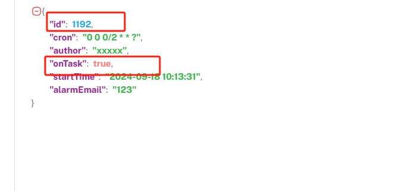
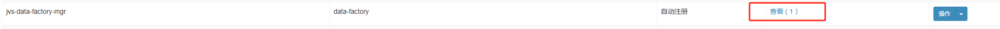
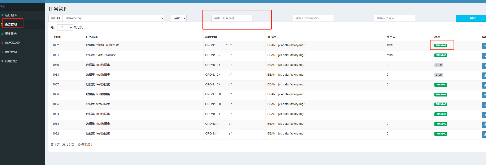

# 问题记录

**本文档记录问题的排查思路。如果根据此文档无法定位到问题，请联系商务**

## 定时任务未执行
**数据集的定时任务只会在启动时生成，所以需要确保此数据是启用状态。注意系统设计的是离线数仓，所以执行频率应当以“天”为基数**
1. 启动成功，但是定时任务未触发

   * 查看数据库 **jvs-data-factory.jvs_data_factory** 中的**task**字段是否如下(id：xxjob生成的定时任务id,onTask:是否启用):
   
   

    * 根据定时任务id或者数据集名称，去xxjob客户端查找此定时任务是否正常执行。xxjob 默认端口为9090。默认账号:admin 密码:123456
      * 首先确认执行器是否注册正常,数量至少为1。如果没有联系贵公司运维排查一下xxjob地址是否正确。
      
                  

      * 查看定时任务是否启动成功

         
        
      * 任务如果启动成功 可以点击操作查看执行日志。如果没有启动就需要排查数据集服务启用时，是否报错。
2. 
